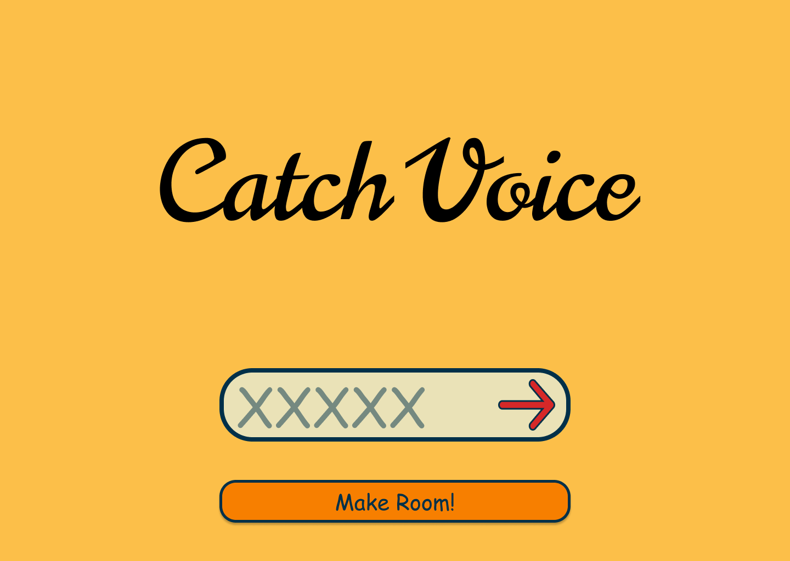

# CatchVoice 🎤🎶

## 노래를 부르고 맞히는 즐거움!

## ✨ 프로젝트 소개

**CatchVoice**는 노래 제목을 보고 직접 노래를 부른 후, 다음 사용자가 그 목소리만을 듣고 어떤 노래인지 맞히는 웹게임입니다. 그림으로 소통하는 게임들과는 달리, 노래를 떠올리고 **'목소리'** 를 통해 노래를 부르며 어디서든 친구들과 즐길 수 있는 환경을 제공합니다.

## 💡 <그대에게> - 무한궤도

<그대에게>는 굉장히 역동적이고, 강렬한 열정, 그리고 웅장함이 느껴지는 곡입니다. 듣다보면 함께 따라 부르고 싶은 느낌이 드는 곡이죠.

저희는 <그대에게>라는 노래를 들으며 함께 노래를 따라부르며 흥얼거리는 모습이 떠올랐습니다. 어디서든 친구들과 노래방과 같은 분위기를 내며 즐길 수 있는 게임을 만들고 싶었습니다.

이 게임은 텔레스트레이션과는 달리 컴퓨터가 없다면 즐길 수 없는 게임이었습니다. 하지만 저희는 이 게임을 웹으로 구현하여, 언제 어디서든 친구들과 함께 즐길 수 있도록 만들었습니다.

또한 이 게임의 단순한 특징은 그저 노래를 녹음하고 재생하는 것을 넘어 다양한 방식으로 변형하여 즐길 수 있는 잠재력이 많은 게임입니다.

## 🎯 목표
* **소통의 장:** 친구들과 함께 노래를 부르며 소통할 수 있는 공간을 제공합니다.
* **재미와 즐거움:** 노래를 부르며 즐거운 시간을 보낼 수 있는 게임을 제공합니다.
* **어디서든:** 웹 기반으로 언제 어디서든 친구들과 함께 즐길 수 있는 게임을 제공합니다.
* **다양한 변형:** 단순한 노래 녹음과 재생을 넘어 다양한 방식으로 변형하여 즐길 수 있는 잠재력을 제공합니다.

## 🎮 주요 기능

* **음성 녹음:** 주어진 노래 제목에 맞춰 자신의 목소리로 노래를 부릅니다.
* **음성 재생:** 다음 사용자는 앞선 사용자의 음성 녹음본만 듣게 됩니다.
* **실시간 게임 진행:** 사용자는 실시간으로 다른 사용자들의 음성을 듣고, 노래 제목을 맞힙니다.

## 🛠️ 기술 스택 (Technical Stack)

* **Backend:** FastAPI (Python)
* **Frontend:** React with Vite (TypeScript/JavaScript)
* **Database:** PostgreSQL

---